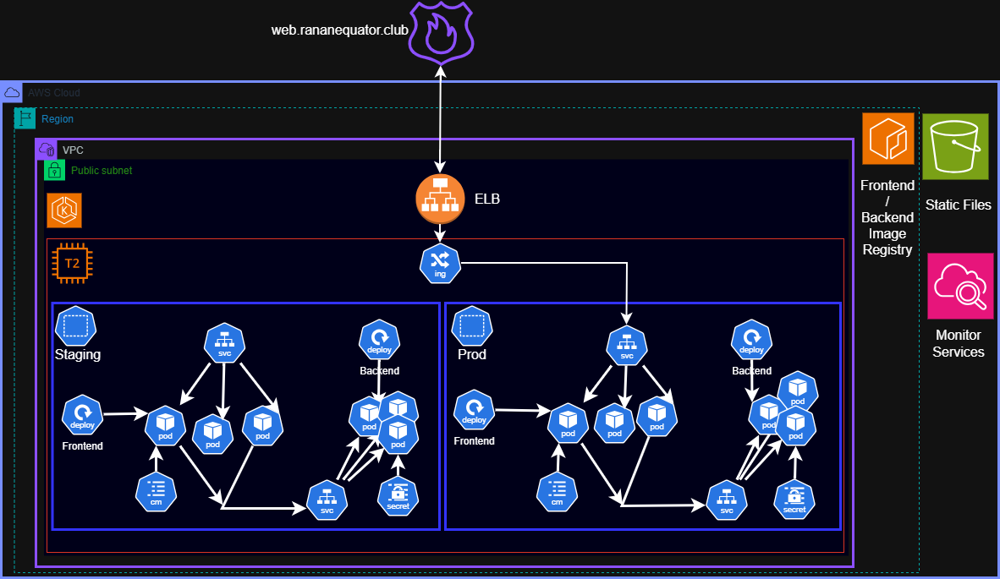
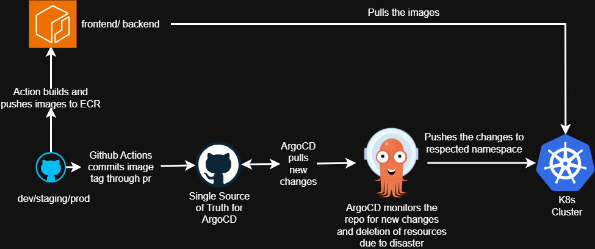

# Web-App

## Application Setup

.png>)

ClientSide: ReactJS
ServerSide: ExpressJS

WEB-APP
├── .github
│   └── ...
├── Assets
├── ClientSide
│   ├── Other
│   ├── public
│   ├── src
│   ├── .gitignore
│   ├── Dockerfile
│   ├── eslint.config.js
│   ├── index.html
│   ├── package-lock.json
│   ├── package.json
│   └── vite.config.js
├── Ingress
├── ServerSide
│   ├── src
│   ├── .gitignore
│   ├── Dockerfile
│   ├── package-lock.json
│   └── package.json
├── Terraform
├── LICENSE
├── package-lock.json
├── README.md

## Containerization
ClientSide
ServerSide

## Orchestration

📦 1. backend/

This folder contains all manifests related to your backend service.

✔ backend.yaml
Deployment for your Node.js / Express backend
Defines replicas, image, env variables, ports, labels.

✔ service.yaml
ClusterIP service that exposes port 80 → 5000
Makes backend discoverable as backend-service.<namespace>.svc.cluster.local

✔ sealedsecret.yaml
This contains your encrypted sensitive data
ArgoCD + Sealed Secrets controller decrypt it at runtime
Stores things like:
JWT secret
MongoDB URI

➡️ All backend configs stay in this folder, making GitOps clean.

🎨 2. frontend/
This folder contains all manifests for your React/Vite frontend.

✔ configmap.yaml
Contains your runtime config (e.g. backend base URL):
{
  "VITE_BASE_URL": "backend-service.prod.svc.cluster.local"
}

✔ frontend.yaml
Deployment for serving your built React app (probably using Nginx).
Defines:
Container image
Volumes (to mount config.json)
Pod labels
Replicas

✔ service.yaml
ClusterIP service for frontend → used by Ingress.

➡️ Keeps frontend configuration isolated and versioned in Git.

.png>)
.png>)
## AWS Infrastructure

🌐 Networking

VPC
Public + Private Subnets
Internet Gateway
NAT Gateway + Elastic IP
Route Tables + Routes

☸️ EKS Cluster
EKS Control Plane
Managed Node Groups (Workers)
Security Groups

🔐 IAM / OIDC
IAM OIDC Provider for EKS
IAM Roles for:
Nodes
Cluster
ALB Controller
Cert-Manager
Cluster Autoscaler
EBS CSI Driver

🐳 ECR
.png>)
ECR Repository for your Docker images
GitHub Actions OIDC Role → Push to ECR

📈 Autoscaling
Cluster Autoscaler IAM + deployment

S3 Bucket
.png>)
To keep static files like images, codes.

## Domain and SSL
.png>)

1️⃣ Create the ClusterIssuer
apiVersion: cert-manager.io/v1
kind: ClusterIssuer
metadata:
  name: http-01-production
spec:
  acme:
    email: prakritimandal611@gmail.com
    server: https://acme-v02.api.letsencrypt.org/directory
    privateKeySecretRef:
      name: http-01-production-cluster-issuer
    solvers:
      - http01:
          ingress:
            class: nginx

2️⃣ Create the Ingress (Nginx)
apiVersion: networking.k8s.io/v1
kind: Ingress
metadata:
  name: my-ingress-1
  namespace: ingress-nginx
  annotations:
    cert-manager.io/cluster-issuer: http-01-production
    nginx.ingress.kubernetes.io/service-upstream: "true"
spec:
  ingressClassName: nginx
  rules:
    - host: web.ranaequator.club
      http:
        paths:
          - pathType: Prefix
            path: /
            backend:
              service:
                name: frontend-service.staging.svc.cluster.local
                port:
                  number: 80
  tls:
    - hosts:
        - web.ranaequator.club
      secretName: web-ranaequator-club

3️⃣ GoDaddy DNS Mapping

Create this A-record:

Host: web
Type: A
Value: loadbalancer_address
TTL: 1 hour

This connects your domain → your ingress controller → your frontend.

4️⃣ How HTTPS Works 🔐✨

cert-manager sees the cluster-issuer annotation
It contacts Let’s Encrypt
Let’s Encrypt sends an HTTP-01 challenge
cert-manager creates a temporary URL at:
http://web.ranaequator.club/.well-known/acme-challenge/<token>

Let’s Encrypt verifies it through your ingress
cert-manager generates the TLS secret:
web-ranaequator-club
  ├── tls.crt
  └── tls.key

.png>)
Nginx uses that secret → HTTPS works
Auto-renews every 60 days.

## CI/CD Pipeline

🚀 CI/CD Pipeline — Explained Clearly
1️⃣ Trigger
The pipeline runs whenever you push to the staging branch.

🧠 2️⃣ Detect What Changed
It checks your repo difference:
If any file under ClientSide/ changed → frontend needs rebuild
If any file under ServerSide/ changed → backend needs rebuild
This saves time → only builds what is required.

🐳 3️⃣ Build & Push Docker Images
For the workloads that changed:
Build a Docker image
Tag it with:
<commit-sha>-staging
Push to AWS ECR
Now you have new container images ready to deploy.

💾 4️⃣ Update Argo-GitOps Repo [GitOps Repo](https://github.com/prakrit55/Argo-GitOps.git)
Pipeline clones your Argo-GitOps repo (staging branch):
Creates a new branch:
staging-<run_number>
Updates the Kubernetes Deployment YAML using yq:
.spec.template.spec.containers[0].image = NEW_IMAGE
Commits the changes and pushes the new branch.

🔁 5️⃣ Create Pull Request
The workflow automatically opens a PR →
head: staging-<run_number> → base: staging

ArgoCD watches the repo → when PR merges, it syncs and deploys new images.
.png>)
.png>)

Backend
.png>)

Frontend
.png>)

.png>)

## Security

Sealed Secrets (by Bitnami) let you store Kubernetes Secrets safely in Git.
They encrypt your Secret using a cluster-wide public key
The encrypted file (SealedSecret) is safe to commit to Git
Only the controller inside the cluster can decrypt it
Even if leaked, no one can read the values

💡 Perfect for GitOps + ArgoCD.

How Sealed Secrets Work ?
You create a normal Kubernetes Secret locally.
Use kubeseal to encrypt it.
The output is a SealedSecret YAML.
You commit this YAML to Git.
In the cluster, the controller decrypts it → creates the real Secret.

📂 Creating Sealed Secrets in Different Namespaces

You must specify the target namespace while sealing.

✔️ Step 1: Create a Secret file

secret.yaml

apiVersion: v1
kind: Secret
metadata:
  name: backend-secret
  namespace: staging
type: Opaque
data:
  MONGO_URI: <base64>

✔️ Step 2: Convert to SealedSecret
kubeseal \
  --format=yaml \
  --namespace=staging \
  --name=backend-secret \
  < secret.yaml > backend-sealed.yaml

✔️ Step 3: Apply to the cluster
kubectl apply -f backend-sealed.yaml

The SealedSecret controller will automatically generate the decrypted Secret inside the same namespace (staging).

kubeseal needs a connection to kubectl and the Kubernetes cluster because it relies on the cluster’s public key to encrypt secrets in a way that only the cluster can decrypt. When you run kubeseal, it queries the cluster via kubectl to fetch the Sealed Secrets controller’s public key. This ensures that the encrypted secret can be safely stored in version control but remains unreadable outside the cluster. Without access to kubectl and the cluster, kubeseal cannot obtain this key, meaning it cannot properly encrypt secrets for that specific namespace or cluster, defeating the purpose of secure, cluster-specific secret management. Essentially, the connection guarantees that secrets are encrypted with the cluster’s authority and can be decrypted only inside that cluster.

## Scale the services

Metrics Server must be installed in cluster

Horizontal Pod Autoscaler (HPA) Setup for Frontend and Backend
This setup ensures that both frontend and backend Deployments in the prod namespace automatically scale their pods based on CPU and memory usage, with controlled scale-up and scale-down behavior.

Frontend: Minimum pods: 2, maximum pods: 8.
Scales based on CPU ≥65% or Memory ≥75%.
behavior ensures gradual scale-down (to prevent sudden pod reduction) and controlled scale-up.

Backend: Minimum pods: 3, maximum pods: 10.
Scales based on CPU ≥70% or Memory ≥80%.
behavior prevents abrupt scale-down and allows faster scale-up for backend workloads.

Metrics Monitoring: The HPA continuously monitors CPU and memory usage of pods.
Scale Up: If average CPU or memory exceeds the target, new pods are created. The scale-up behavior ensures pods are added in a controlled way (percent or fixed number).
Scale Down: If usage drops below the target, pods are terminated gradually, respecting the stabilizationWindowSeconds to avoid flapping.

.png>)